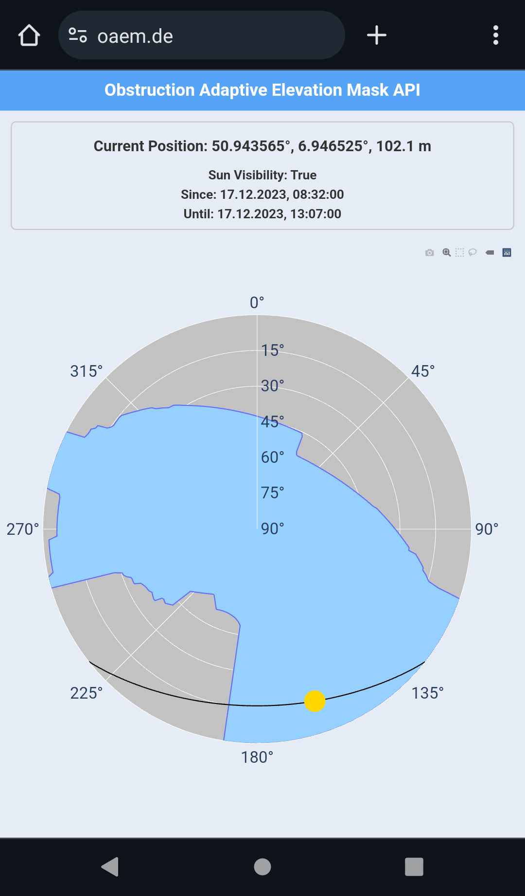

<div align="center">
<h1>Obstruction Adaptive Elevation Mask API</h1>

#### API to query an Obstruction Adaptive Elevation Mask (OAEM) for a given position using CityGML models.


</div>

The plot you can see here is a so-called skyplot that depicts the view into the sky from a given position. The position of an object in this plot is described using azimuth (i.e. north 0°, east 90°, south 180°, west 270°) and elevation (0° horizon, 90° zenith). The grey area shows the blockage of the free sky view (blue) due to buildings. The yellow circle is the current position of the sun along its trajectory (black).

The darkblue outline of the sky view is called Obstruction Adaptive Elevation Mask (OAEM) [[Zimmermann 2019]](https://www.researchgate.net/publication/329833465_GPS-Multipath_Analysis_using_Fresnel-Zones). It is possible to compute this OAEM from the user position because of existing CityGML databases. CityGML models are XML based representations of buildings and can either be retrieved from [local file storage](https://www.opengeodata.nrw.de/produkte/geobasis/3dg/lod2_gml/lod2_gml/) or from [Web-Feature-Services (WFS)](https://www.wfs.nrw.de/geobasis/wfs_nw_3d-gebaeudemodell_lod1). This data exists for most german or international cities, however, they are not always free. The code is designed for LOD1 or LOD2 building models from Geobasis NRW, Germany. In its current state, it is therefore only applicable within North Rhine-Westphalia, Germany.

An OAEM can be useful in various scenarios, e.g. GNSS Signal filtering:


This software uses and includes the Quasigeoid from:

> © [BKG](https://www.bkg.bund.de/) (Jahr des letzten Datenbezugs) [CC BY 4.0](https://creativecommons.org/licenses/by/4.0/) , Datenquellen: https://sgx.geodatenzentrum.de/web_public/Datenquellen_Quasigeoid.pdf


## Install and run

Using Docker Compose:

```yaml
services:
  oaemapi:
    image: gtombrink/oaemapi:latest
    ports:
      - "8000:8000"
    volumes:
      # - ./gmldata:/app/gmldata # use of local CityGML data
      - ./config.py:/app/config.py

volumes:
  gmldata:
```

For this to work, you need to create a config.py file in the same directory as the docker-compose.yml file. The config.py file is used to configure the API. See the [Configuration](#configuration) section for more information. 

Start the container with:

```bash
docker-compose up -d
```

The API is then available at http://localhost:8000.

### Local CityGML data

If you plan to use local CityGML data, you need to place it in a folder that is mounted to the container. In the example above, the gmldata folder is mounted to the container.

The software makes use of the file naming convention of [Geobasis NRW CityGML files](https://www.opengeodata.nrw.de/produkte/geobasis/3dg/lod2_gml/lod2_gml/) to avoid the need of a database. Files need to be named in the following way:

```
LoD{LOD}_{UTM_ZONE}_{XXX}_{YYYY}_1_NW.gml
```

where:

- `{LOD}` is the level of detail (1 or 2)
- `{UTM_ZONE}` is the UTM zone (e.g. 32)
- `{XXX}` are the first three digits of the easting (e.g. 348)
- `{YYYY}` are the first four digits of the northing (e.g. 5698)

## Endpoints

In summary, the following endpoints are available:

| Endpoint | Description |
| --- | --- |
| / | Very simple frontend showing a skyplot at the current user location with the OAEM and the current sun position. |
| /oaem | Returns the OAEM for a given position. |
| /plot | Returns a plot of the OAEM for a given position. |
| /sunvis | Returns the sun visibility for a given position. |

You can find detailed information about the Endpoints at http://127.0.0.1:8000/docs after starting the server.

## Configuration

Configuration is done in the config.py file:

```python
import logging

import numpy as np

OAEM_RES = np.deg2rad(1)  # resolution of the OAEM grid in radians

N_RANGE = 80  # neighborhood radius in meters
N_RES = 20  # request neighborhood every N_RES meters

ROUNDING_EPSG = 25832  # EPSG code of the coordinate system used for rounding (relevant for N_RES)

FAVICON_PATH = "./app/data/favicon.ico"

GEOID_FILE = "./app/data/geoid.txt" # needs to be downloaded from BKG
GEOID_EPSG = 4258
GEOID_RES = 100

EDGE_SOURCE = "FILE"  # "WFS" or "FILE"
EDGE_DATA_PATH = "./gmldata"  # only relevant if EDGE_SOURCE == "FILE"
EDGE_LOD = 2  # 1 or 2, 2 includes roof shapes and more detailed buildings but is slower
EDGE_EPSG = 25832  # EPSG of the CityGML data source

WFS_EPSG = 25832
WFS_URL = "https://www.wfs.nrw.de/geobasis/wfs_nw_3d-gebaeudemodell_lod1"
WFS_BASE_REQUEST = "Service=WFS&REQUEST=GetFeature&VERSION=1.1.0&TYPENAME=bldg:Building"

APP_HOST = "0.0.0.0"
APP_PORT = 8000
logging.basicConfig(
    format="%(levelname)-8s %(asctime)s.%(msecs)03d - %(message)s",
    level=logging.INFO,
    datefmt="%Y-%m-%d %H:%M:%S",
    # filename="./oaemapi.log",
)
logger = logging.getLogger("root")

with open("./app/version", "r", encoding="utf-8") as f:
    VERSION = f.read().strip()
```

The geoid file is available at [BKG](https://gdz.bkg.bund.de/index.php/default/quasigeoid-der-bundesrepublik-deutschland-quasigeoid.html). The CityGML data can be downloaded from [Geobasis NRW](https://www.opengeodata.nrw.de/produkte/geobasis/3dg/lod2_gml/lod2_gml/). The data is available under the [DL-DE->Zero-2.0](https://www.govdata.de/dl-de/zero-2-0) license. Alternatively, the data can be retrieved from the [WFS of Geobasis NRW](https://www.wfs.nrw.de/geobasis/wfs_nw_3d-gebaeudemodell_lod1) by setting `EDGE_SOURCE` to `WFS` and `EDGE_LOD` to `1`. The WFS is only available for LOD1 buildings.